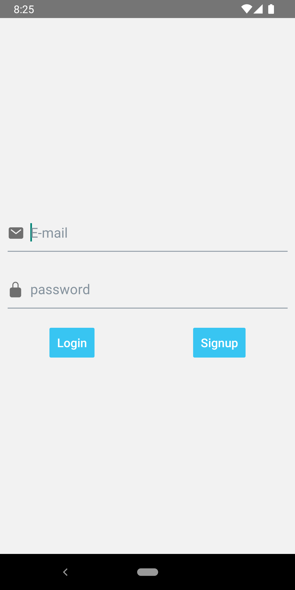
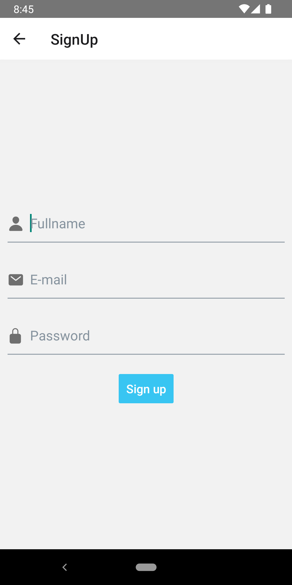
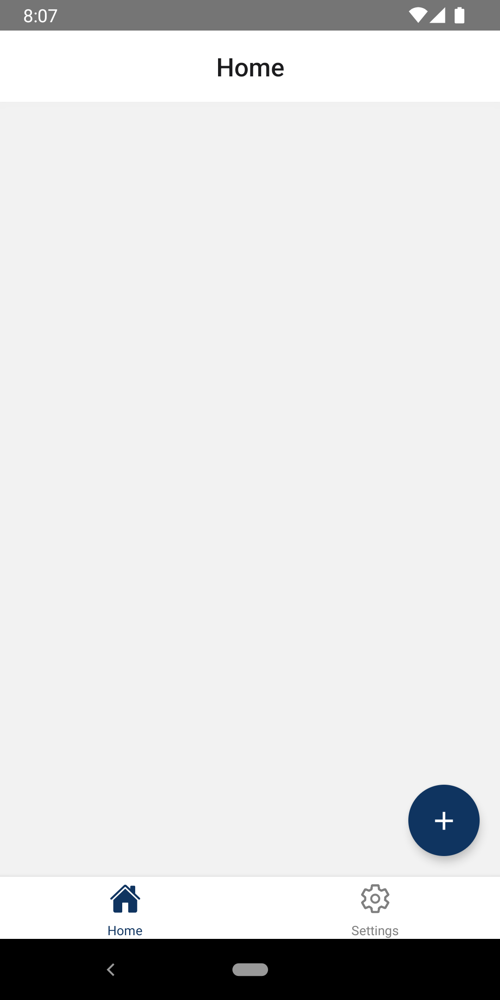
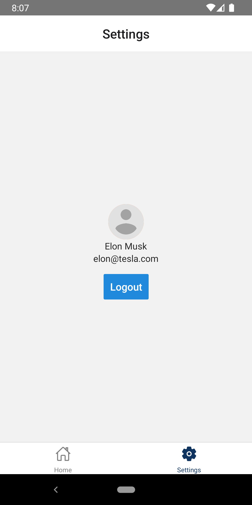
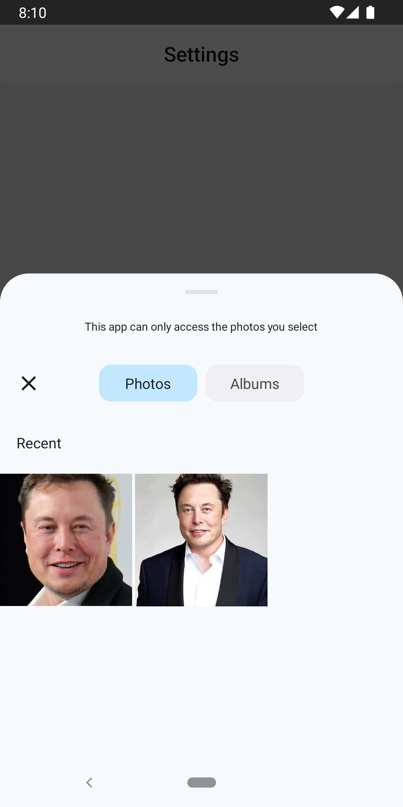
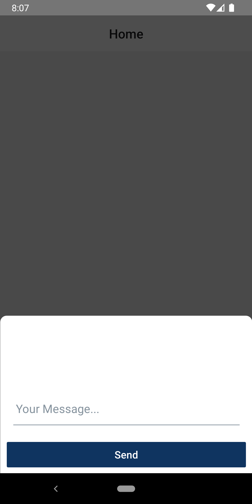
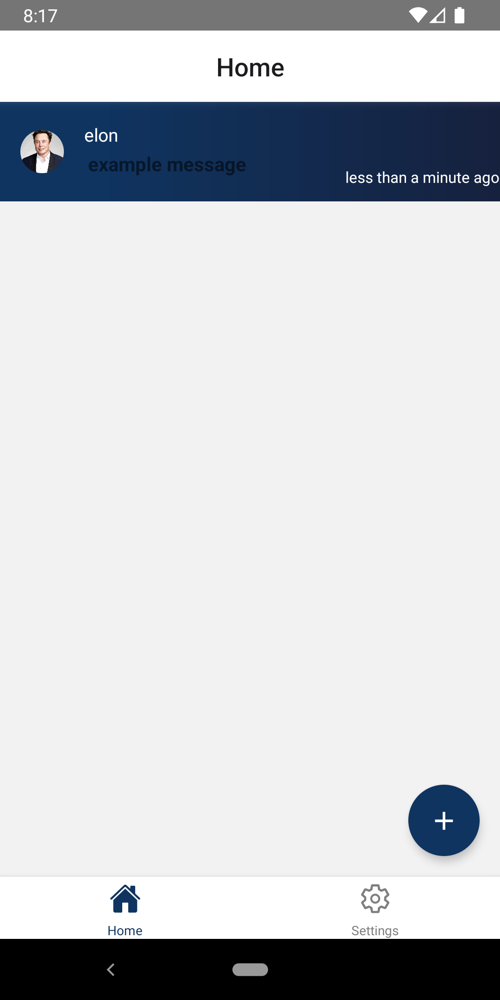
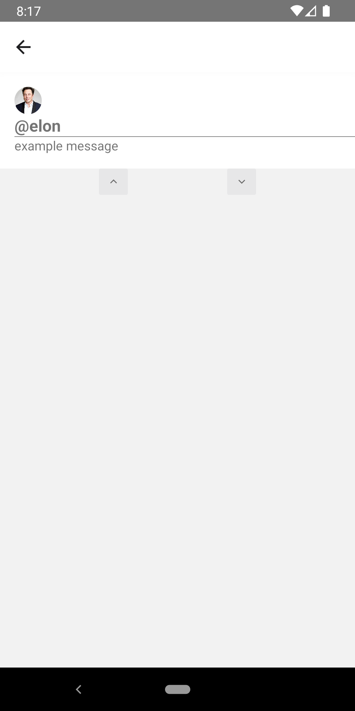

## About

This project is Simple Social Media app in react-native with firebase

## Photos

| Sign-in Screen                     | Sign-up screen                     |
| ---------------------------------- | ---------------------------------- |
|  |  |

| Home Screen                                     | Settings Screen                               |
| ----------------------------------------------- | --------------------------------------------- |
|             |         |
| İmage Picker                                    | Updated Settings screen                       |
|          |    |
| Message Modal                                   | Updated Home screen                           |
|  |  |
| Detail Screen                                   |
|         |

# Installation

```git
git clone https://github.com/mrsonmez/rn-firebase-socialmedia-app.git
cd rn-firebase-socialmedia

create a firebase app from firebase.google.com/

select the android app give the same name from android/app/src/main/AndroidManifest.xml > package name
in this app it should be com.socialmediaapp and download google-services.json
then copy the file to android/app/
npm install
npm run android
```

# Used Techs

```
React-native,Formik,Firebase,Lottie,React Native Elements,Date-fns
```
